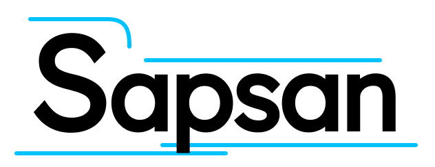

The ultimate framework for DevOpsLess principle based on 'Jenkins Shared Library'

## Dependencies
- System: `Linux` or `MacOS`
- Software:
  - `Git v2.39.2`
  - `Docker v20.10.23`

## How to Use

## Local Testing
There is [testing](/testing) folder with the neccessary files to easily prepare simple infrastructure.

### Build master container
```shell
docker build -f Dockerfile.master -t jenkins-master .
```

### Run master container
```shell
docker run -d --name master \
  -p 8080:8080 \
  -p 50000:50000 \
  -e JAVA_OPTS=-Dhudson.plugins.git.GitSCM.ALLOW_LOCAL_CHECKOUT=true \
  -v /var/run/docker.sock:/var/run/docker.sock \
  -v $(pwd)/jenkins_home:/var/jenkins_home \
  jenkins-master
```

### Build agent container
```shell
docker build -f Dockerfile.agent -t jenkins-agent .
```

### Run agent container
The agent container will be started by the master container. See the next step.

### Configure master
Go to `Manage Jenkins > Manage Nodes > New Node` and set up the following properties:
- Set `Remote root directory` to `/home/jenkins/agent`
- Set `Launch method` to `Launch agent via execution of command`
- Set `Launch command` to `docker run -i --rm --init --name agent jenkins-agent java -jar /usr/share/jenkins/agent.jar`

Go to `Manage Jenkins > Configure System > Global Pipeline Libraries` and setup the following properties
- Press `Add`
- Set `Name` to `sapsan`
- Set `Default version` to `main`
- Setup `Retrival method` for your desire

### SCM
We are going to use opensource [SCM Manager](https://scm-manager.org)

```shell
docker run -d --rm --name scm \
  -p 8081:8080 \
  -v $(pwd)/scm-manager_home:/var/lib/scm \
  scmmanager/scm-manager:latest
```